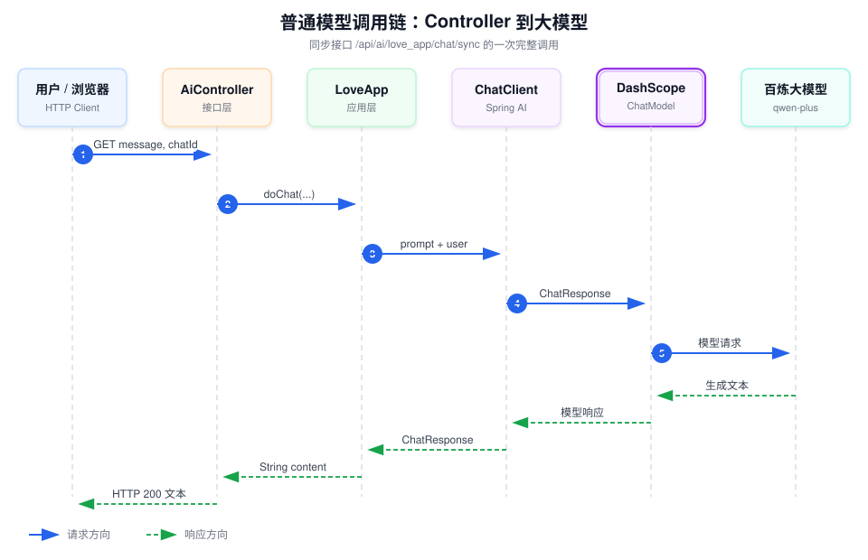

# 01｜普通模型调用

这篇笔记记录 `ai-agent-demo` 中最基础的一条 AI 调用链：用户通过 HTTP 接口发送消息，后端使用 Spring AI 调用百炼大模型，最后把模型生成的文本返回给用户。

本仓库的可运行实现位于 `Agent-Learning-Journey`：`POST /api/chat` 调用 `LearningChatService`，根据 `provider` 路由到 DeepSeek 或 MiniMax 对应的 `ChatClient → OpenAiChatModel`。Provider 不同，但 Controller、应用服务、`ChatClient`、`ChatModel` 的分层与本篇讲解一致。

学习这一部分时，先忽略 RAG、工具调用、MCP 和 Agent。只关注一个问题：**一条用户消息是怎样从 Controller 到达大模型，再变成 Java 字符串返回的？**

## 调用链总览



用一行文字表示：

```text
用户 → AiController → LoveApp → ChatClient → DashScopeChatModel → 百炼大模型
```

响应沿着相反方向返回：

```text
百炼大模型 → DashScopeChatModel → ChatClient → LoveApp → AiController → 用户
```

## 抽象调用链

先不看具体类名，一次普通模型调用可以抽象为：

```text
用户
→ Controller
→ Service / Application
→ ChatClient
→ ChatModel
→ 模型平台
→ 返回生成文本
```

对应到当前项目：

```text
用户
→ AiController
→ LoveApp
→ ChatClient
→ DashScopeChatModel
→ 阿里云百炼 qwen-plus
→ ChatResponse
→ String
→ 用户
```

这条链需要同时从两个方向理解：

```text
请求方向：业务数据逐层转换为模型 Prompt 和厂商请求
响应方向：厂商响应逐层转换为 ChatResponse、文本和 HTTP 响应
```

## 每层的职责

| 层次 | 当前项目实现 | 接收什么 | 产出什么 | 核心职责 |
|---|---|---|---|---|
| 用户/客户端 | 浏览器或前端 | 用户输入 | HTTP 请求 | 收集问题并展示结果 |
| Controller | `AiController` | HTTP 参数 `message`、`chatId` | Java 方法调用或 HTTP 响应 | 接收、绑定、校验请求，转换协议 |
| Service/Application | `LoveApp` | 业务参数 | 模型调用结果 | 组织提示词、会话、业务规则并编排模型调用 |
| ChatClient | Spring AI `ChatClient` | system/user 消息、Advisor、Options、Tools | `Prompt` 与模型调用结果 | 提供应用层链式 API，封装 Prompt 构建和调用流程 |
| ChatModel | `DashScopeChatModel` | Spring AI `Prompt` | 标准 `ChatResponse` | 把统一对象适配为厂商协议，再把厂商响应转回统一对象 |
| 模型平台 | 百炼 `qwen-plus` | 厂商 API 请求 | 厂商 API 响应 | 执行模型推理并生成 Token |

### Controller：处理 HTTP 协议

Controller 处于系统边界，应该负责：

- 声明请求路径和 HTTP 方法；
- 绑定查询参数、路径参数或请求体；
- 做格式、必填项和长度等输入校验；
- 调用应用层；
- 将应用结果转换为 HTTP 状态码和响应体。

Controller 不应该负责：

- 拼接大段系统提示词；
- 直接管理 Chat Memory；
- 根据模型厂商拼装 HTTP 请求；
- 承载复杂业务规则；
- 处理模型 Provider 的底层响应格式。

当前示例：

```java
@GetMapping("/love_app/chat/sync")
public String doChatWithLoveAppSync(String message, String chatId) {
    return loveApp.doChat(message, chatId);
}
```

它已经完成参数接收和应用层转发，但尚未显式校验 `message`、`chatId` 是否为空以及消息长度。学习示例可以保持简洁，生产接口则应补充 Bean Validation、统一异常处理和请求大小限制。

### Service/Application：表达业务用例

这里的 Service/Application 指业务应用层，不一定要求类名以 `Service` 结尾。当前项目使用 `LoveApp` 表达“恋爱助手对话”这一业务用例。

它应该负责：

- 定义应用角色和系统提示词；
- 根据 `chatId` 选择会话上下文；
- 组合 Chat Memory、RAG、Tools 等能力；
- 选择同步或流式调用；
- 提取并转换模型结果；
- 实现与具体业务有关的流程和规则。

它不应该负责解析 HTTP 查询参数，也不应该直接依赖百炼的原始 HTTP JSON。这样同一应用能力才能被 Controller、定时任务、消息消费者或测试代码复用。

当前项目的核心调用：

```java
public String doChat(String message, String chatId) {
    ChatResponse chatResponse = chatClient
            .prompt()
            .user(message)
            .advisors(spec -> spec.param(ChatMemory.CONVERSATION_ID, chatId))
            .call()
            .chatResponse();

    return chatResponse.getResult().getOutput().getText();
}
```

### ChatClient：组织一次模型交互

`ChatClient` 是建立在 `ChatModel` 之上的应用层调用门面。它通过链式 API 负责：

- 创建本次 Prompt；
- 添加 system、user 和历史消息；
- 合并默认与单次 Options；
- 执行 Advisor 链；
- 注册可用工具；
- 选择同步或流式模式；
- 按文本、完整响应或 Java 对象返回结果。

可以把它理解为“模型调用的编排器”，但它不是某个模型平台的底层 HTTP SDK。最终的厂商适配仍由 `ChatModel` 实现完成。

### ChatModel：适配具体模型厂商

`ChatModel` 是 Spring AI 的统一模型接口。当前注入的实际实现是 `DashScopeChatModel`，它负责：

1. 接收 Spring AI 的 `Prompt` 和 Chat Options。
2. 转换为百炼接口需要的请求格式。
3. 携带 API Key 调用正确的 Base URL。
4. 处理同步或流式响应。
5. 把厂商响应转换为统一的 `ChatResponse`。

因此，业务代码可以面向 `ChatModel` 编程，而不需要理解每个厂商的请求 JSON。但“统一接口”不等于“所有模型能力完全相同”：工具调用、视觉、思考模式和部分生成参数仍受具体模型与 Provider 限制。

### 模型平台：执行推理

百炼模型平台收到请求后，主要负责：

- 校验 API Key、模型权限、额度和限流；
- 根据 Model ID 选择 `qwen-plus`；
- 对输入 Token 执行模型推理；
- 生成文本、工具调用或其他输出；
- 返回用量、结束原因、请求 ID 等可用元数据。

模型平台不知道 Java Controller、`LoveApp` 或 `chatId` 的业务含义。只有应用真正放入请求消息或参数中的内容，模型平台才能处理。

## 数据在每层如何变化

以用户输入“你好”为例：

```text
浏览器
  message=你好&chatId=test-001
        ↓ Spring MVC 参数绑定
AiController
  Java String message、chatId
        ↓ 普通 Java 方法调用
LoveApp
  本轮消息 + 会话 ID + 系统提示词 + 历史消息
        ↓ ChatClient 构建
Prompt
  List<Message> + ChatOptions
        ↓ DashScopeChatModel 转换
百炼请求
  model=qwen-plus + messages + parameters
        ↓ 模型生成
百炼响应
  generated text + usage + finish reason
        ↓ DashScopeChatModel 转换
ChatResponse
  Generation + AssistantMessage + Metadata
        ↓ LoveApp 提取文本
String
        ↓ Spring MVC 写入响应体
HTTP Response
```

这说明每一层不只是“把同一个字符串继续传下去”，而是在完成协议转换、业务补充或对象标准化。

## 为什么要分层

分层的价值不是增加类的数量，而是隔离变化：

| 发生变化 | 主要影响层次 |
|---|---|
| GET 改为 POST JSON | Controller |
| 恋爱助手改提示词或业务流程 | Service/Application |
| 加入 Chat Memory、RAG、Advisor | Service/Application / ChatClient |
| 百炼切换为其他 Provider | ChatModel、Starter 和配置 |
| `qwen-plus` 改为同 Provider 的其他模型 | 模型配置与兼容性测试 |
| 页面展示方式改变 | 前端/客户端 |

如果 Controller 直接调用厂商 SDK 并拼接 Prompt，这些变化会混在同一个方法中，难以测试、复用和替换。

## 入口：AiController

同步接口定义在：

```text
ai-agent-demo/src/main/java/com/yupi/yuaiagent/controller/AiController.java
```

核心代码：

```java
@GetMapping("/love_app/chat/sync")
public String doChatWithLoveAppSync(String message, String chatId) {
    return loveApp.doChat(message, chatId);
}
```

应用配置了 `/api` 作为统一上下文路径，所以完整地址是：

```text
GET /api/ai/love_app/chat/sync?message=你好&chatId=test-001
```

两个请求参数分别表示：

- `message`：用户本次发送的消息。
- `chatId`：会话标识，相同标识下的消息共享对话记忆。

Controller 本身不负责组织 Prompt，也不直接调用模型。它只负责接收 HTTP 参数，并把请求转交给 `LoveApp`。

## 应用层：LoveApp

核心代码位于：

```text
ai-agent-demo/src/main/java/com/yupi/yuaiagent/app/LoveApp.java
```

### 初始化 ChatClient

`LoveApp` 的构造器接收 Spring 容器提供的 `ChatModel`，然后基于它创建 `ChatClient`：

```java
public LoveApp(ChatModel dashscopeChatModel) {
    MessageWindowChatMemory chatMemory = MessageWindowChatMemory.builder()
            .chatMemoryRepository(new InMemoryChatMemoryRepository())
            .maxMessages(20)
            .build();

    chatClient = ChatClient.builder(dashscopeChatModel)
            .defaultSystem(SYSTEM_PROMPT)
            .defaultAdvisors(
                    MessageChatMemoryAdvisor.builder(chatMemory).build(),
                    new MyLoggerAdvisor()
            )
            .build();
}
```

这里可以先抓住三个重点：

1. `ChatModel` 是底层模型能力的统一抽象。
2. `ChatClient` 是更方便的高层调用 API，用来组织系统提示词、用户消息和 Advisor。
3. `MessageChatMemoryAdvisor` 会根据 `chatId` 读取和保存上下文，实现多轮对话。

### 发起同步调用

`AiController` 调用的是 `LoveApp.doChat`：

```java
public String doChat(String message, String chatId) {
    ChatResponse chatResponse = chatClient
            .prompt()
            .user(message)
            .advisors(spec -> spec.param(ChatMemory.CONVERSATION_ID, chatId))
            .call()
            .chatResponse();

    return chatResponse.getResult().getOutput().getText();
}
```

这段链式调用可以拆成五步：

| 代码 | 作用 |
|---|---|
| `prompt()` | 创建一次新的提示词请求 |
| `user(message)` | 添加本轮用户消息 |
| `advisors(...)` | 把 `chatId` 设置为对话 ID |
| `call()` | 发起同步模型调用，当前线程等待结果 |
| `chatResponse()` | 获取包含模型输出和元数据的响应对象 |

最后通过下面的对象路径取出文本：

```text
ChatResponse
└── Generation result
    └── AssistantMessage output
        └── text
```

## Spring AI 如何找到百炼模型

项目在 `pom.xml` 中引入了 Spring AI Alibaba 的 DashScope Starter。Spring Boot 启动时会根据配置自动创建 `DashScopeChatModel`，然后把它作为 `ChatModel` 注入 `LoveApp`。

相关配置位于：

```text
ai-agent-demo/src/main/resources/application.yml
```

关键配置结构：

```yaml
spring:
  ai:
    dashscope:
      api-key: 你的 API Key
      chat:
        options:
          model: qwen-plus
```

真实 API Key 应放在被 Git 忽略的本地配置或环境变量中，不能提交到仓库。

## 一次请求实际发生了什么

以请求“你好”为例：

1. 浏览器向同步接口发送 `message=你好` 和 `chatId=test-001`。
2. Spring MVC 把查询参数绑定到 `AiController` 的方法参数。
3. `AiController` 调用 `loveApp.doChat(message, chatId)`。
4. `LoveApp` 创建 Prompt，加入系统提示词、历史消息和本轮用户消息。
5. `ChatClient` 把请求交给 `DashScopeChatModel`。
6. `DashScopeChatModel` 将 Spring AI 对象转换成百炼接口需要的请求。
7. 百炼上的 `qwen-plus` 模型生成回答。
8. 响应被转换成 `ChatResponse`。
9. `LoveApp` 提取回答文本并返回给 Controller。
10. Controller 把字符串写入 HTTP 响应体。

## 同步调用与流式调用

本篇关注的是同步调用：

```java
.call()
.chatResponse()
```

它会等待模型生成完整回答后一次性返回。项目中的流式版本使用：

```java
.stream()
.content()
```

流式调用返回 `Flux<String>`，模型生成一部分内容，后端就可以向前端推送一部分。理解同步调用之后，再学习 SSE 会更容易。

## 动手验证

启动后端：

```bash
cd /Users/zcy/IdeaProjects/agent-workspace/ai-agent-demo
sh ./mvnw spring-boot:run
```

然后在浏览器中访问：

```text
http://localhost:8123/api/ai/love_app/chat/sync?message=你好&chatId=test-001
```

继续使用相同的 `chatId` 追问：

```text
http://localhost:8123/api/ai/love_app/chat/sync?message=我刚才说了什么&chatId=test-001
```

再换一个 `chatId` 发起同样的追问，比较模型是否还知道之前的内容。这可以直观看到“模型调用”和“对话记忆”是两个不同层次的能力。

## 本节应掌握的概念

- Controller 只处理接口协议，不应该承载模型调用细节。
- `LoveApp` 是应用层，负责组织 Prompt、记忆和模型调用流程。
- `ChatClient` 是 Spring AI 提供的高层客户端。
- `ChatModel` 屏蔽了不同模型厂商之间的调用差异。
- `ChatResponse` 不只有回答文本，还可以包含模型生成结果及元数据。
- `call()` 是同步调用，`stream()` 是流式调用。

## 自测问题

1. 为什么 `AiController` 不直接注入并调用 `ChatModel`？
2. `ChatClient` 和 `ChatModel` 分别承担什么职责？
3. `chatId` 没有直接发送给大模型，为什么它仍然能影响多轮对话？
4. 如果把 `.call()` 改成 `.stream()`，Controller 的返回类型需要怎样变化？
5. 如果没有配置 DashScope API Key，请求会在哪一层失败？
